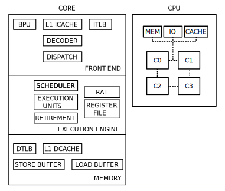

$
title: The First Devlog
date: 2022.03.20
$
**IMPORTANT NOTE:** This 'devlog' is very opinionated and not very scientific (or even logically valid and quite stupid at some points), as the arguments made are based mostly on 'common sense'. I wrote this mostly for my own sake, as to make it clear what I really want from the language and how it should work. Something that should also be noted is that I grew very tired of writing a devlog instead of writing code, which can be seen in the deterioration of my writing and arguments from the Progamming and Coding section and onward.


The title of this devlog may be a bit deceiving, as this log was not written before starting, or anywhere near the start of, the project. This iteration of the project began in November 2021, and the compiler for the language has been completed up to, but not including, iterative type checking. The reason I say 'this' iteration, is that the project has been rebooted countless times since the first iteration in 2019, and is going to undergo another reboot during this devlog. So, in a sense, this is the last devlog for the previous iteration, as well as the first for the new iteration.

Anyway, the motivation for this project is largely to take a step away from the rat's nest of complexity that modern software has become, mainly by making a language with accompanying tools that try to alleviate these problems.


## Project history and Approach
The set of goals has varied for each iteration, some more than others. At first, the main goal was to create a C compiler with metaprogramming capabilities similar to Jai. This proved out to be difficult, as parsing C is a horrible experience, and modifying its grammar to support multiple return values, type inference and other shenanigans made it way worse. Some later iteration scrapped the C syntax, in favor of a syntax similar to Odin/Jai, and then the main goal was to make metaprogramming maximally powerful. This, in my mind, implied that the language should be made as simple as possible, such that metaprogramming only had to deal with its own complexity, and not some arbitrary cruft in the language design. However, this ended up getting out of hand, making the language concepts deviate too much from what actually runs on hardware. The next iteration then focused on making every decision grounded in reality, by examining a selection of target systems, and trying to construct a common model. From the selection of hardware I made, this became a rat's nest of complexity. Trying to learn from my mistakes, the last iteration made focused on making a simple bare-bones prototype of something I thought would work, and then evaluating and iterating upon that prototype. This is kind of the most obvious tactic to solving a problem, since you never truly know how it should be solved before actually solving it. I always knew this, but I kept thinking I wanted to avoid the common mistake in software of making something that seems to work, and then bunching on a ton of complexity to handle new features and fix bugs. The way I thought was the correct way of avoiding this was to thoroughly examine the problem and design everything neatly to solve that specific problem. However, as previously stated, you never truly know how a problem should be solved before actually solving it, which ended biting me hard. I kept on wasting way too much time on planning, afraid of writing something ad hoc that works, since it might not be the optimal solution I was looking for. Which is kind of weird, since I am not afraid of rewriting everything, as I have countless times (in total I have pushed 89 thousand lines of code to github, and removed 76 thousand, over the course of three iterations). What I should have learned is that the problem of tacking on complexity and making a mess, doesn't come from not planning enough, it comes from not discarding prototypes, and building upon them instead. Since I am clearly not afraid of scrapping everything, as opposed to some project manager in a company, I should leverage this, and stop "overplanning". The next iteration of the project will therefore prioritize making quick prototypes, instead of simulating a design committee with choice paralysis.

## Foundation
Now that the general development approach has been decided, what is it that I will be making? This seems like a weird question, since this is clearly a project devoted to making a programming language and compiler. However, making a programming language is not a very specific goal, as it leaves a bunch of questions like is it compiled or interpreted, is it object oriented or maybe functional, and generally what is actually accomplished by making yet another random programming language? To answer some of these questions, I will be taking a step back and evaluate what a programming language should be, what I want to accomplish by making one and what a programming language even is to begin with.

### What is a programming language?
According to the Wikipedia page on the [history of programming languages](https://en.wikipedia.org/wiki/History_of_programming_languages)
```
"It was eventually realized that programming in assembly language required a great deal of intellectual effort"
```
Which seems to imply that the reason programming languages came about was that programming in assembly was too hard, and that an easier way of programming computers would come in the form of programming languages. Viewed in a positive light, this statement seems like it makes sense, and would sort of imply that programming languages are a superior lossless representation of machine code that is easier understood by humans. However, when you think about how quality software is made today, a lot of it comes down to having fine grain control of what the computer does. Which, in my mind, is not very far away from programming in assembly. So in short, making software using programming languages is superior to assembly, except for when you want to make software of high quality. Then why was programming in assembly viewed as a problem, when it seems like assembly clearly is useful for some parts of programming?

#### Control
In my opinion, it all comes down to control. Assembly tends to offer the programmer more control than other programming languages. Control over where values live and which operations are used (to an extent, since machine code has become more of a suggestion to modern processors, as opposed to a list of strict instructions). This control gives a programmer the power needed to optimize routines, and crank out every single drop of that sweet sweet performance juice (one could argue this is also possible with intrinsics, however they are even more of a suggestion than assembly). However, this control also comes with a responsibility, a responsibility to utilize the computing resources effectively. With a higher level programming language, this responsibility is often shifted more towards the language, which makes easier to write non optimal programs that still run relatively efficiently. This is essentially the advantage of programming languages, they allow you to gain ease of use in exchange for control. 


#### "Zero Cost Abstractions"
When people talk about so-called "zero cost abstractions", they often try to explain why a certain language construct abstracts away a bunch of complexity, and allows a programmer to express logic in simpler terms, while still keeping the "performance" of writing it all out in assembly. This is basically never true, "zero cost abstractions" always lose something, since that is what it means to abstract *away* something. Abstraction will always reduce control. Even "trivial abstractions" such as replacing opcodes with mnemonics reduces control. Now the programmer cannot reason about the relative order of instructions given by their opcode's value without looking up the value for each mnemonic and breaking the abstraction. This might seem like a silly example, as knowing the relative order of instructions by their opcode seems useless, and mnemonics are surely easier to remember than a string of digits. However, knowing the opcode for each instruction is incredibly useful when writing self modifying code. This nicely illustrates the point that abstraction is always at the loss of something, and also leads up to the next point.


#### Breaking Abstractions
So far it would seem like every programmer is stuck with a choice between not having enough control to write optimal software, and too much control with not enough skill, or experience, to properly utilize it. However, this is not the only option. The previous paragraph may have made breaking the "instruction mnemonic" abstraction seem like something bad, but this might actually be the best solution we have. Surely writing software with maximal control would be the optimal solution for an all-knowing intelligence. However, as humans are famously bad at always making optimal decisions, programming with maximal control may not be the best solution. The obvious answer to this would be mixing levels of abstractions when it is deemed necessary. This would allow programming at the "lowest level" of abstraction the programmer is confident in, while still keeping the option for maximal control when deemed necessary. While sounding wonderful, this introduces a whole new class of problems relating to cooperation between layers of abstraction, as an assembly routine is useless if it cannot read the value of its parameters, due to them "being stuck at a higher level of abstraction".

#### Programming languages
At this point, a somewhat useful definition of a programming language can be formed.
```
A programming language is an, often multi-layered, abstraction of machine code
```
Which is obvious, but what is useful about this definition is that is illustrates a problem with most languages, namely that it is an **abstraction**. By being an abstraction, every language will therefore inherit the problem of managing control. Despite this being a glaring problem, when the goal is to write optimal software, it would seem like languages these days are praised for their abstractions. From the object-oriented languages such as Java, to scripting languages like Python, they are all praised for their "ease of use", and accompanying implied ease of writing robust and secure software. This is just absurd, as what people are basically saying is that these languages make software easier to write, more robust and secure, by allowing the programmer not to care how the program works. Which is kind of bonkers, because how would we know that the program is actually more robust and secure if nobody knows how it actually works. And if someone does know how it works, and can vouch for these claims, why couldn't they write it instead, as they clearly know more about the program than the actual programmers who wrote it. What these languages offer is a (mostly) unbreakable high level abstraction of machine code, and if you agree with the previous paragraph, this is obviously a stupid design if writing optimal software is the goal. However, you still have to remember how we got here, which was initially by quoting Wikipedia stating that assembly is often too hard to work with.


Then for a programming language to be a useful concept, I would propose the following: 
```
A programming language should be an arbitrarily high stack of abstractions over machine code that the programmer is in full control over, and allows them to seamlessly transition from one layer to another
```
Programming languages should therefore not restrict the programmer to an arbitrary level of abstraction, but rather provide the tools to build abstractions over the lowest possible level, and make transitioning between layers seamless.

### Aspects of programming
#### Programming And Coding
The words 'programming' and 'coding' are often used interchangeably when referring to the work of a software engineer. This is not how I personally use these words, as I view these as labels for two distinct parts of a software engineer's job. I view programming as the act of solving problems and phrasing the solutions in ways a computer could run. Coding is to me the act of encoding that solution, which is basically the same as translating decimal to binary, just with different rules. Now, what does this have to do with the previous topic of programming language design and abstractions? The gist of it is that when programming, the 'programmer', has a mental model of how the program should work, and how it solves the problem at hand. This model is then encoded into, most often, text, and can be decoded again at a later time. There are now two different representations of the model for how the program should work, and this causes some problems.


Firstly, lossy, or faulty, encoding or decoding results in a disconnect between the models. The most obvious example of this is the programmer making a mistake when encoding the solution, and either causing a syntax error, something more grave. Moreover, since humans are flawed, the process of encoding and decoding mental models is both lossy and faulty, making collaborating with several people, and even oneself, hard. This is because the mental model of each person may differ greatly from both every other person's model and the encoded model.


Secondly, the coding format may indirectly affect the 'solution space' explored by the programmer. Ideas that are harder to encode will naturally be avoided when the solver of the problem at hand, and the encoder of the mental model, are the same person. This does not only cause problems for lone programmers, but will also ultimately affect the society, making some solutions unfavorable simply because they are harder to encode.


Finally, the efficiency of the encoding and decoding process is largely dictated by how much the code format differs from the mental model. Which is only natural, as a coding format that is an exact copy of the mental model's format does not require any work to encode and decode.


To alleviate these problems, the coding format should be chosen carefully to match 'the mental model' as closely as possible. However, for a language to be useful to a group of people, the coding format must be chosen to match their mental models, which becomes increasingly more impossible as the group size expands. Furthermore, the coding format must change over time, as people tend to learn and restructure how they think. This approach also has the problem of penalizing experienced problem solvers, in favor of matching more closely to the mental model of beginners, given they are the increasing majority.


The problem is most often 'solved' by a committee designing a format and dictating that everyone should adjust their mental model to match. This is often a terrible approach, as it forces people to think in ways that are often inefficient and 'creatively limiting'. Furthermore, the dictated mental model often tend to favor matching beginners, rather than more experienced developers. Which is all well when it can be used as a steppingstone, but is vastly unfavorable for the advancement of technology. However, the alternative of adapting the coding format to every single person is even worse off. This approach makes it almost impossible for any two people to work together, which is frankly a lot worse than lowering the efficiency, or limiting creativity. The compromise I would propose is to base the coding format and intended mental model on the basics of how a computer works, along with well established constructs in programming languages. This is not the most optimal solution, by far, but it would be familiar to experienced programmers, as well as providing beginners with an easy introduction by learning the basics of computers.


Now, proposing that something should follow 'established principles and basic theory of a computer', without elaborating on exactly what that means, is almost like saying 'yes, I too like good compromises', while thinking to yourself that you are much smarter, and experienced, than everyone around you. Therefore, I will at least make an attempt at defining things. Also as a preface, I must make it clear that my own experience consists mostly of self-taught game programming in C\#, C++ and C with nothing even resembling a half-finished product to speak of.

##### The Basics of a Computer
As previously stated, programming can be thought of as solving problems and phrasing the solution in a way that is executable by a computer. This implies that the abstract properties of a computer are fundamental to the act of programming. Furthermore, as real life metrics, like time used and power consumed, are of interest, not only are the abstract properties important, but also the actual inner workings, as they dictate these metrics. 


However, once again, we encounter the tradeoff of control vs complexity. To optimally utilize the computer requires a lot of control, which requires the programmer knowing every tiny little detail about the computer. Furthermore, the programmer needs to know every tiny little detail about every single computer the program is to be run on. Which in turn consists of countless combinations of components, which are, most often, of high complexity themselves. The tactic to 'solve' this problem is once again to recognize some commonalities between computers and make an abstraction that is as close to this, while still being general enough to hold true for every system. 


However, on modern systems, this is much harder than one would think, as even simple things like arithmetic behaves vastly different on x86 and ARM (mostly related to exceptions and bitwise shifts), making constructing a layer of abstraction with minimal loss of detail very hard. On top of that, I, the author, have no experience, whatsoever, with the internals of a modern processor (past the 'basics'), and that's not even talking about the monstrosity that is a GPU. With the problem being a tough tradeoff, and me lacking experience, the solution is in a way doomed to be awful. Moreover, for the solution to be any good, a beginner has to be able to learn it easily without having to study computers for a decade. 


Before trying to make an abstract machine that complies with these demands, it would be wise to pick the target hardware the language should support. Since the language is mainly concerned with systems level game programming, hardware on all major consoles and common pc builds must be supported. x64 dominates this market, with some systems running x86 or ARMv8-A. For GPUs the situation is a bit more complicated. As far as I know, there isn't a convenient way of talking to the GPU without going through a vendor specific proprietary driver. This, along with other functionality locked by the OS, ends up restricting the model to essentially a CPU running an OS with drivers. This isn't the optimal, super simple, all encompassing model that would be very nice to have, but is probably the only reasonable model given the restrictions.


The task is then to create a model for x86, x64 and ARMv8-A based systems paired with the common operating systems, including console operating systems. From what I have gathered by glossing over the wikichip pages for [zen](https://en.wikichip.org/wiki/amd/microarchitectures/zen) and [kaby lake](https://en.wikichip.org/wiki/intel/microarchitectures/kaby_lake), as well as the arm developer [block diagram](https://developer.arm.com/documentation/ddi0488/h/introduction/about-the-cortex-a57-processor) of a cortex-a57, modern processors tend to look like this:

<figure style="margin: 0; padding: 0;">
	
	<figcaption style="margin: 0; padding: 0; text-align: right; font-size: 0.8em;">Figure 1: A crude abstract model of a quad-core cpu</figcaption>
</figure>

Where essentially the CPU consists of several cores wired together, and connected to a shared memory controller, io and cache. The individual cores can be split in three different components: the front end, the execution engine and the memory subsystem. The front end takes care of fetching and decoding instructions to feed the execution engine. The branch predictor takes care of predicting which instructions should be prioritized, the instruction cache serves as the primary cache for instruction fetching, and the instruction translation lookaside buffer caches TLB lookups done for instructions. The execution engine consists mostly of a scheduling unit that feed the instructions from the front end into several execution units, that do the work specified by the instruction. Registers needed by these instructions are fetched from the register file, which is essentially an array of register sized values with the mapping from register name to array index stored in the register allocation table. The scheduler feeds the instructions (usually micro ops at this stage) into the execution units out of order, and the results are then put back in order in the retirement buffer.

The main differences between the architectures, observable by the programmer, are the specifics of how the execution units work. There are differences in how many units there are and which operations the units support, which are mostly of concern when dealing with optimization, which requires programming with the target system in mind, which would then not concern the abstract model. What does concern the model is how the operations work and what side effects they produce. All architectures in question support 2's complement integer and IEEE 754 floating point arithmetic, however they differ in how they deal with edge cases. Most of the edge cases I have found are illegal operations, however there are some that seem like they should be legal. One of these is a shift instruction with a shift amount greater than the width of the shift operand. Intuitively, this would just shift "more", following the pattern of shifting by width - 1 times until the shift amount is less than width, and then shifting by the remainder. This is however not what happens, as the shift amount is masked before the shift with 0x1F (bottom five bits little endian), which implies any shift amount where the remainder of a division by 32 is 0 will result in no shift, and a shift amount of 33 will shift one place instead. Another weird edge case is integer division by 0. On x86 and x64 a divide error is issued when dividing by zero with no result (that I could find at least), but on ARMv8-A the result is 0, with no trap issued. This is kind of hard to model around, as there is no common result of the operation. The laziness of C comes in handy in these situations, where we could just flag these edge cases as architecture dependent behavior and call it done.

##### Established Language Constructs
Although there have been made countless programming languages, most languages today fall into three categories: languages that build upon C, languages that build upon Lisp or any other non systems programming language, and esoteric languages. This is a crude simplification, but, truth is, most modern (I hate that word) systems programming languages are inspired by C. Of course there are languages that inspired C (B is one of them if I remember correctly), but the point is that most systems and application programming languages today, like C++, Java, C\#, Rust, Odin, Pyhton and even Javascript (yuck), all share a large resemblance with C. C has therefore been huge factor in shaping how we think about, teach and view programming. Some of the major ideas that have survived are: structured programming, types, variables and pointers. The only additions (I can think of) that C makes upon this is text processing with the preprocessor, goto, switch and inline assembly. Starting of the language will be based on the major ideas. 

#### Raising Walls
"Raising walls" is what I call segmenting code. This could be separating code into several scopes, functions, files or even libraries. The point is that you are making a mental distinction between two different pieces of encoded logic and enforcing some kind of encapsulation-esque ruleset on them. "Raising walls" is a tool,  with its own set of tradeoffs that depend on the specific circumstances. And unlike OOP, I would not advocate encapsulating code willy-nilly. This is because encapsulating code, or "raising walls" around the code, affects more than just "code quality", it affects the solution space. This concept is explained well in Casey Muratori's [The Only Unbrekable Law](https://youtu.be/5IUj1EZwpJY). When designing the import system for one of the last iterations of the language, this was something I became aware of. I was basing the import system in how it works in Odin, which requires that each file is tagged with a package they belong to. This ensures nice properties like stable linking names that don't collide, but it also has the unfortunate property that it encourages segmenting a program into several packages, especially since the main package cannot contain more than one file (since there are no C like include directives). This is of course not a problem if you don't think of spreading your code over several packages as making hard boundaries between them, but it does still encourage thinking in this way, and since there is no "softer" version of this, like including files, you are forced early on in a project to take a stance about how the project should be organized, which is the worst point to enforce rules, since you know the least about the project.

#### User Interfaces
Although I haven't improved much in terms of software architecture, one aspect of programming that I notice an improvement in is making code readable. This is not by following any of those stupid conventions on formatting, but by structuring code in a way that is most helpful when reading. This includes simple things like spacing things that don't relate to each other further away, gathering things that do relate, and using consistent names that carry information on type and usage. But also gathering information that is relevant for a block of code as close to the start of the block as possible, and choosing the shortest or most relevant block of an if-else chain and placing it closest to the condition. Furthermore, I use three different styles of commenting, the regular //, a /// and a ////. This is used to affect the syntax highlighting of the comment, which I then use to markup code. // is used for normal comments, /// is used for headings and has a lighter and bolder color, while //// is used to mark errors and is a very prominent orange color. This allows me to quickly identify blocks of code and find error out conditions to orient myself when reading.

Thinking about this, I realized that everything I do follows the Gestalt principles of design. I gather things closer together to take advantage of the principle of proximity to indicate relation, and vice versa with spreading code apart. The same holds for structuring blocks of code, with the most "block relevant" parts first. Furthermore, the variable naming and comment coloring utilizes the principle of similarity. Although this is not a perfect relationship, I have realized that computer science should really take a look around at what other fields are doing and learning from them, because there is soooo much more to making code readable than some dumb lint script. Everything is about encoding intent and guiding the reader.

#### Concept Art
Another aspect of programming that should be revised in light of how other fields deal with the problem is workflow and planning. To me, architecting a program is very similar to concept art, or character design. Concept art is made for the purpose of guiding design, by realizing different design options such that they can be compared. The workflow is very centered around iteration, where several variations of an initial design description are made, then a couple of them are selected as candidates and used to seed new variations until the final design is decided. This has the very real advantage of making the effect of each decision measurable, which in turn makes deciding where to go next easier. This is typically not how software is designed. A typical software workflow starts with defining and breaking up the task, then completing each fragment and stitching each piece together. This seems like an effective approach until you start to consider the implications of defining and breaking up the problem at the very start. You never truly know what the best solution to a problem is without having tried it out. This means you never truly know if your choices are optimal until you have made them, measured their effects, and compared them against every other possible choice. To assume someone, who hasn't solved a problem is able to optimally define and break up the problem into tasks, is just bonkers. This is essentially the same as making decisions about optimization purely based on guesses about their effects, which the industry has coined premature optimization, and is dead set on hating on it every chance it gets. Now of course more iterations costs more time and resources, but if the goal is to create the best product possible with a set amount of resources, I would place way more importance on experimenting and iterating on different parts of the design in order to gather the necessary information to make good decisions about it.

#### Daredevil Programming
The last aspect of programming I want to bring up is what I, as of writing this sentence, call "Daredevil programming". This is a term that describes the current lack of programmer "visibility" in a lot of tools and languages. An example of this is compiler magic and undefined behavior, where the compiler can do whatever it wants to, without signaling the programmer. Another example is the lack of good visualization tools in debuggers, making the programmer either resolve to using a third party tool and painstakingly manage the transferring the state and building models, or construct this model in their heads with the raw data readout from the debugger. Each of these examples show a lack of direct communication with the programmer, making them resort to indirect observations, and since the Daredevil comic book character sees only indirectly via sound and smell, I thought the name was fitting. As I see it, the only real solution to these problems is making compilers simpler and more transparent about how they work and which decisions they have made, as well as beefing up debuggers, since the state most debuggers are in today is quite sad (look at WhiteBox or Casey Muratori's Mustache for an example of what a more beefy debugger could do).

## Designing the Language
Taking the conclusion on what a language is and the observations on different aspects of programming into account, the time has come to begin designing the language. Now, instead of starting with assembly and building upward, I am going to start at the middle and build in both directions. The middle is in this case structured programming. I am opting to rip most of this from C, in an effort to preserve the same "mental model of programming". The language will then have the concept of a statement, blocks of statements, control structures and procedures. The control structures need a condition, which I again rip from C by introducing the concept of an expression. I assume that nothing introduced yet seems alien, and will therefore skip explaining how they work. Now, if going strictly with the C versions, an example program could look like:
```
<some way of defining a procedure>
{
	<statement>
	<statement>
	if (<expression>)
	{
	}
	else if (<expression>)
	{
	}
	else while (<expression>)
	{
		for (<expression>; <expression>; <expression>)
		{
			break;
		}
		
		continue;
	}
}
```
These do however have some drawbacks. One of these is illustrated in two common patterns in C:
```
if ((variable = procedure_call()) == value)
{
}
```
```
while ((variable = procedure_call()), variable != value)
{
}
```
Here, the lack of an "init statement" for **if** and *something I do not know the name of* for **while** is remedied by using/abusing the comma operator and assignment as an expression. This trick is neat, but it does somewhat obscure the intent of the programmer, if you are not accustomed to it. Furthermore, it isn't safe, as the order of evaluation for comma separated expressions is undefined behavior, and in my opinion playing with equals as an expression is a dangerous way of introducing weird typo bugs. The **if** case is often solved by giving the if statement an init clause, similar to the for statement.
```
// w/o init
if (<expression>)
{
}

// w init
if (<some statement or expressions>; <expression>)
{
}
```
Solving the **while** thing is a little harder, since the straight forward solution is to add an option for specifying a statement that is run before every evaluation of the condition, where the side effects of the statement is the only useful part. From what little I know of code analysis and optimization, this sounds like a nightmare to handle. Now the easy cop out is to not support it, which would force the programmer to write something like:
```
while (true)
{
	variable = procedure_call();
	if (variable != value) break;
	...
}
```
Which is harder to pattern match against when reading code, since it is more blown up, but I would say it is not a bad compromise.


Another question is whether to keep both **while** and **for**. Ignoring *do-while*, **for** is essentially a beefier **while**. Some languages, like go and Odin, have opted to remove **while**, in favor of **for**. In the last iteration of the language, I opted too to remove one of these, but I chose to chuck **for** instead. This was partly because I found it clearer when not using the step clause of the **for**, since spelling out "while some condition holds true" and "while starting from something, some condition holds true" felt more natural than "for some condition holds true" and "for starting from something, some condition holds true". Another reason for this was that I thought about introducing some kind of *for each* construct, which seemed to fit **for**, especially since I also thought about introducing some "element in collection" syntax, which collided with the *for each* syntax. At the expense of adding weirdness without a good reason, I opt to go with this idea of beefing up **while** and reserving **for** for some *for each* type loop.


One question that hasn't been answered is which statements can appear in the init clause. You might have noticed that the **if** init clause was marked with "some statement or expressions". This is because I wanted to remove assignment as an expression, which would disallow assignment in the init clause if it only accepted expressions. Allowing expressions and the assignment statement will yield the same functionality as the C trick, however I believe we could do one better by adopting the **for** loops init statement. This would allow not only expressions and assignment, but also variable declarations, giving way for expressing things like:
```
if (Token token = GetToken(); token.kind == SOME_KIND)
{
}
```
This is another one of those "it shouldn't hurt right?" decisions, but I don't think it should be a huge problem, especially since the goal is not to create a perfect language, but a language that does something right, and is at least as good as C. 

Continuing with the theme of loop constructs: should **break** and **continue** be carried over, and should they be edited, or should additional "jump statements" be introduced? **break** and **continue** are essentially structured replacements for **goto** for loop constructs. Since they are quite well engrained in how we think about loops, I opt to keep them without much modification. However, something I see value in is copying Odin and adding labeled **break** and **continue**, and allowing labeled **break** to break out of normal scopes. The reason I propose this is that normal **break** and **continue** do not cover all functionality provided by **goto**, and since **goto** violates structured programming, it would certainly be nice to replace **goto** with a structured approach. Again, at the expense of adding something without much of a good reason, I opt to follow Odin's example. However, this also involves adding the **defer** statement, in order to replace most of what is useful with **goto**. This would then allow expressing the following:
```
{
	defer label: {
		while (condition)
		{
			if (some_other_condition) break label;
			else if (yet_another_condition) break;
		}
		...
	}
	...
}
```
Which would execute at the of the enclosing scope, looping until one of the conditions are met, and either breaking out of the labeled block, or the loop.


That covers the control structures in structured programming, leaving only procedures, statements and expressions. To be brief, I opt to follow Odin's example once again, by making procedures expressions, allowing multiple return values, and adopting this syntax:
```
// procedure litteral
procedure_type { procedure_body }

// procedure type
proc                        // no parameters, no return value
proc()                      // no parameters, no return value
proc(params)                // parameters, no return value
proc -> ret_val             // no parameters, one return value
proc() -> ret_val           // no parameters, one return value
proc(params) -> ret_val     // parameters, one return value
proc -> (ret_vals)          // no parameters, one or more return values
proc() -> (ret_vals)        // no parameters, one or more return values
proc(params) -> (ret_vals)  // parameters, one or more return values
```
With procedures come **return**, and call expressions.


Everything up until now has been added kind of ad hoc, without much explanation. The reason for that is twofold. Firstly, these are constructs that I am certain should be in the language, and the specifics (syntax and semantics) have proven themselves both in actual use in Odin and in the design of previous iterations. Secondly, I am trying to avoid digging a monstrous hole by nitpicking every little detail, and instead relying more on what has "proven" to be effective to some degree. However, for the remaining topics, that will change. First off is expressions.


Expressions are built up from basic primitives with operators to produce zero or more values, who's interpretation and usage are determined by their type. There are three things to unravel here: primitives, operators and types.  Of the three, the concept of a type is where I suspect most potential of improvement would lie. For the primitives and operators, I will opt to use what I designed for the last iteration, which looks as follows:
```
//// primitives
identifiers  - identifier
"strings"    - string literal
20           - integer literal
2.0          - float literal
true         - boolean literal
T.{E,E,..}   - struct literal
T.[E,E,..]   - array literal

//// operators (precedence low to high)
.I
^, ., [E], [E:E], (E,E,..)
^, [E], []
T.(E),                         // T.{}, T.[] parsed at this level 
+, -, !, ~
*, /, %, &, <<, >>, >>>
+, -, |, ~
==, !=, <, >, <=, >=
&&
||
?:


//// Notes
T.(E) is a cast from the type of E to the type T
.I is an enum selector expression, "shorthand" EnumName.I
^ signifies a pointer, pointer type ^T, reference ^E, dereference E^
[E] postfix is a normal subscript, prefix is an array type specifier
[] is a slice type specifier
[E:E] is a slice subscript
(E) is a normal call
~ unary is bitwise not, binary is xor
```

Something that may appear foreign is the periods between the type and parentheses for casts. This is a syntax I came up with for allowing anonymous struct and array literals, and optionally could be used for inferred casts, with the same format (type period paren expression/-s paren).


Again, borrowing from Odin, the language will have variables and constants, which can be declared as follows:
```
//// variable declaration
name : type;                          // 'name' will be zero initialized
name : type = ---;                    // 'name' will not be initialized
name : type = value;
name0, name1 : type = values;         // values is a multivalued expression
name0, name1 : type = value0, value1;

//// constant declaration
name : type : value;
name0, name1 : type : values;         // values is a multivalued expression
name0, name1 : type : value0, value1;
```


Now the more interesting topic is types. Types are in my mind data descriptors. They describe how to interpret and how to use, and how big a block of bytes is, turning useless garbage into information. This concept is used in all proper statically compiled programming languages, although to varying degree. 


Most languages use types to indicate how big something is, and how to interpret it, but they are often "falling short" when dealing with how it should be used. What I mean by this is that size and interpretation are mostly solved, as apposed to usage. In C, types affect which operators can be used, how they behave and what type of result they produce. It also decides whether the compiler is allowed to do some type of optimizations (volatile) and whether some l-values are directly writable (const). Now, the restrictions and behaviour of operators, as well as volatile, are useful effects of types on usage, but they are only a subset of effects that are useful. 


One example of a restriction on usage that is useful is introducing some type qualifier like "frame_local", which restricts access for storing a value directly and indirectly in variables or memory ranges that are not also "frame_local". This would help eliminate state creep and dangling pointers in games, and is only one example of a type qualifier that would be a useful addition. What this indicates to me is that users should be able to add type qualifiers with arbitrarily complex rules. Furthermore, I would also suspect that there should be an explicit way of adding and removing these qualifiers, that cannot be accidentally used (e.g. if regular casts could remove these, changing code that involved a cast by introducing a "frame_local" value could silently introduce bugs). Some related work I found was this article on user defined [semantic type qualifiers](https://doi.org/10.1145/1064978.1065022), which might be something that is worth adding to the language in one shape or another. However, this seems to me like something that adds more complexity than it solves problems.


I also found something similar, but way more involved and powerful, when searching for more information on "user defined type qualifiers", which was this [talk](https://www.youtube.com/watch?v=zt0OQb1DBko), which serves as a peek into the programming language ATS. What ATS seems to offer, based on that talk, is really powerful user controlled type checking, at the expense of introducing a whole bunch of semantic and syntactic complexity. This actually seems like a reasonable approach for supporting very rich and tight criteria on how the code should behave (e.g. enforcing that resources do not leak on a type level, or asserting that a recursive procedure will terminate). The problem is of course that the language complexity goes through the stratosphere, in exchange for control that is really nice, but has limited usage in non-critical software. This is illustrated in Rust, where the language has some similar concepts to enforce rules on a codebase that aim to increase program security, at the expense of added complexity. However, Rust does not go the whole way, and offers only a partial solution (AFAIK), making the added complexity, in my mind, outweigh the supposed benefits (I have not programmed in Rust, so this might be completely false, and I might be a moron, but this is the impression I have gotten hearing about the language). It would then be nice not to repeat the same (assumed) mistake in this language, and I would suspect that would be achieved by making it easier to detect and fix these problems, instead of trying to build the language around proofs (which will never reflect reality anyway, since the computer might be hit by a cosmic ray, invalidating the supposed proof of correctness). Whether user defined type qualifiers would aid in this is not clear. 


Now this could also be solved by introducing metaprogramming and allowing a metaprogram to inspect the compiling program, and look for these things manually. Since metaprogramming adds a lot more of useful functionality than this, whether user defined type qualifiers should be added is then a question of how often they are useful, and if the complexity reduction from searching manually in a metaprogramming is significant enough.


As an experiment, I tried implementing "frame_local" using polymorphic procedures and structs in Odin, which almost worked. The three main problems with this mock implementation is the lack of operator overloading (FL_OPNAME is used instead), determining the return type for member access and that it relies heavily on the compiler chucking everything that isn't relevant for the program at runtime when optimizing.

```
package main

import "core:fmt";
import "core:reflect";

Frame_Local :: struct(T: typeid) { _: T }

FL_Deref :: proc(fl: Frame_Local(^$T)) -> Frame_Local(T)
{
	return Frame_Local(T){ (transmute(^T)fl)^ };
}
FL_Ref :: proc(fl: ^Frame_Local($T)) -> Frame_Local(^T)
{
	return Frame_Local(^T){ cast(^T) fl };
}
FL_Assign :: proc(fl: ^Frame_Local($T), nfl: T)
{
	(cast(^T) fl)^ = nfl;
}
FL_Add :: proc(fl0: Frame_Local($T), fl1: Frame_Local(T)) -> Frame_Local(T)
{
	return Frame_Local(T){ transmute(T)fl0 + transmute(T)fl1 };
}
FL_Mul :: proc(fl0: Frame_Local($T), fl1: Frame_Local(T)) -> Frame_Local(T)
{
	return Frame_Local(T){ transmute(T)fl0 * transmute(T)fl1 };
}

// NOTE: This does not work, but may be possible if struct_by_field_name
//       produced a constant value that could be used as a typeid
/* 
FL_Member :: proc(fl: Frame_Local($T), $member_name: string) -> reflect.struct_field_by_name(T, member_name).type.id
{
	fl := fl;
	field := reflect.struct_field_by_name(T, member_name);
	return cast(field.type.id) (uintptr(&fl) + field.offset);
}
*/
main :: proc()
{
	a := Frame_Local(int){};
	b := FL_Ref(&a);
	c := FL_Deref(b);

	fmt.println((cast(^int)&a)^);
	fmt.println((cast(^int)&b)^);
	fmt.println((cast(^int)&c)^);

	FL_Assign(&a, 10);
	fmt.println((cast(^int)&a)^);

	d := FL_Add(a, a);
	fmt.println((cast(^int)&a)^);
	fmt.println((cast(^int)&d)^);

	P :: struct {
		a: int,
		b: f32,
	};

	e := Frame_Local(P){};
	f := FL_Deref(FL_Ref(&e));
	
	// NOTE: This does not work, which is the desired behaviour. However,
	//       there should be a way of defining custom error messages for
	//       these cases that would be more informative than "operator '+'
	//       is only allowed with numeric expressions"
	//g := FL_Add(e, f);

	h := FL_Mul(a, d);
	fmt.println((cast(^int)&h)^);
}
```

Since it seems like common user defined type qualifiers might be implementable by using polymorphism and relying on compiler optimizations, or analysis by a metaprogram, and that they carry a fuck ton of complexity if they were to be implemented in the type system properly, it would seem like this is once again a "control vs. usability" tradeoff. I will then opt to go for usability and not include this. However, I will see if there is a nice way of implementing something similar, but simpler, later.


Another topic relating to types is polymorphic types, procedure overloading and operator overloading. All of these are missing from C, and are kind of unnecessary. Although they are used extensively, I have rarely seen these features used in a way that is more useful than renaming a function call. Some exceptions are polymorphic dynamic arrays, which take advantage of the type information attached to the dynamic array structure to retrieve the size and alignment of each element, as well as returning the proper element type. This does however have some clear drawbacks, which mostly sums up to code bloat. The usual implementation of polymorphism tends to massively duplicate nearly identical code, only to achieve some programmer convenience by utilizing the type system more than the equivalent implementation in C would. Overloading, on the other hand, tends to only save some typing, but may also allow changing behavior without affecting usage code. These features are really nice to have, but the cost is so large compared to the benefit, that they should probably not be used, at least not as often. However, I would still like to add something like polymorphism, since it adds a lot of expressive power, of course at the expense of bloat. The task is then to find a way of either dealing with this bloat, or better yet, removing it entirely.


Let's start by examining Odin's polymorphism. Procedures and structs take parameters. Procedures may take both constant and non-constant parameters, but structs take only constants. AFAIK, every time a new set of constant parameters are passed in, the procedure or struct is duplicated and specialized with the passed values. This is what quickly turns into bloat. One possible remedy is "implicit procedure parameters" (which is something I came up with while writing this). In C there is a trend to make preprocessor macros that hide some parameters to a function, and pass in additional information (e.g. line number, file).

```
void* AllocateMemory(unsigned int size, unsigned int alignment, unsigned int line, char* filename);
#define Allocate(size, alignment) AllocateMemory((size), (alignment), __LINE__, __FILE__)
#define AllocateStruct(T) (T*)AllocateMemory(sizeof(T), ALIGNOF(T), __LINE__, __FILE__)
#define AllocateArray(T, size), (T*)AllocateMemory(sizeof(T)*(size), ALIGNOF(T), __LINE__, __FILE__)
```

The file and line information may then be used for debugging, and may also be removed when building for release. This is solved in Odin by introducing the \#caller_location compiler directive, which sort of makes the caller pass in file and line implicitly. This does however not support the other trick in that code snippet, which is turning a type into size and alignment. Aside from the proper return type, this is all the element type specific information a polymorphic array implementation needs. Passing this information as parameters instead of duplicating the code, and hard coding the values, would severely reduce code bloat, at the expense of a more general procedure which cannot be optimized based on the constant values. This concept can be expressed in Odin using a layer of indirection:

```
AllocateMemory :: proc(size: uint, alignment: uint, location: Source_Code_Location) -> rawptr
{
	// TODO: Allocate memory
}

Allocate :: inline proc(size: uint, alignment: uint, location := #caller_location) -> rawptr
{
	return AllocateMemory(size, alignment, location);
}

AllocateStruct :: inline proc($T: typeid, location := #caller_location) -> ^T
{
	return cast(^T) AllocateMemory(size_of(T), align_of(T), location);
}

AllocateArray :: inline proc($T: typeid, size: uint, location := #caller_location) -> ^T
{
	return cast(^T) AllocateMemory(size_of(T) * size, align_of(T), location);
}
```

This will duplicate the all procedures, except the first, for every type they are used with, however this will only duplicate the call, which can be inlined easily. This goes to show that polymorphism can be made less bloaty by introducing helper procedures, and move the polymorphism to them, which sort of implies that the bloat problem with polymorphism might not be an inherent flaw, but rather a side effect of non-optimal usage. At least with an aggressive compiler, this would probably compile out to the code you would want, but that might not be the case every time. Relying on compiler optimizations to untangle and smooth out something is dangerous, since when the compiler eventually fails to do this, there might be a fuck ton of bloat left in the program. This might be the case with Julia, where simple, and moderately complex, expressions are resolved, but complex expressions might exhaust the resolution budget of the compiler, leaving a lot of bloat behind. This can lead to some fun scenarios where making some small changes might change the runtime of the program by several orders of magnitude.


Polymorphism might therefore not be a bad addition. Overloading may also prove more useful when combined with polymorphic procedures and structures. This is because they would allow writing general code that are specialized by the compiler. Overloading does however favor code duplication, since duplicating the code is necessary to specialize, which would again increase code bloat. This could work out if inlining is beneficial, which would then remove the bloat, but this is probably not the case for procedures of a size where the bloat has a significant impact. The easy cop out is to leave this problem to the programmer, but it would be better if there was some facilitation in the language for mitigating code bloat caused by this. One very manual mitigation I can think of is using a jump table for overloaded calls. This would allow more polymorphic procedures to remain unified, but this is very circumstantially helpful, and is very much in the realm of the optimizer, not the language. Another mitigation I can think of is splitting the procedure into several mostly non-polymorphic pieces, and stringing them together in a polymorphic procedure. This is again not a language level mitigation, since now the user is responsible for doing the work, but as of now, I don't see any better alternatives than to leave the mitigation up to the programmer, and be aggressive about code removal when optimizing.


Another aspect of overloading that should be considered is whether it should be implicit (like C++) or explicit (like Odin), and which operators should be overloadable. Implicit overloading is generally most useful, while explicit overloading tends to be easier to keep track of. The main deciding factor is how this affects metaprogramming, since allowing addition of new overloads, when some entities are already resolved, will lead to dependency hell. Although I would like explicit overloading, because IMO most sane usage of overloading is very contained, it does reduce the flexibility of the language. Implicit overloading will therefore be preferred if it can mesh nicely with metaprogramming. The deciding factor is then if reasonable implicit overloading can be defined in such a way that there are absolutely no ambiguities, since an ambiguity could lead to choosing the wrong overload at the wrong time. By following Odin's example and heavily restrict implicit conversions, the cases where ambiguities arise shrink dramatically. However, there are still some ambiguities in Odin:

```
A :: proc(i: int) -> rune do return 'A';
B :: proc(f: f32) -> rune do return 'B';
AB :: proc{A, B};

fmt.println(AB(1));
```

Both procedures (A and B) are present in the overload set, A will be chosen when the input is 1, However, when only B is in the overload set, B will be chosen instead. If B and the AB call were to compile before A, the wrong overload would be chosen. This issue arises in Odin because of its untyped types, which can implicitly convert to several other types. In this example, 1 is of type untyped int, which can implicitly convert to any numeric type, including both int and f32. One easy way to resolve this is to disallow implicit untyped int to float converions, but this does not cover implicit untyped int to fixed width int conversions, which would also result in an ambiguity. One surefire way to resolve this is to disallow implicit conversions to procedure parameters, however this would also affect operator overloading if it were implemented with overloaded procedures (making a + 1 illegal because of the ambiguity). The only reasonable solution I can think of at the moment is making untyped int to float and untyped float to int conversions illegal, and require that no overloads have ambiguities. Except for the int <=> float conversion, this is how Odin handles it. The reason Odin can get away with looser rules is that the overload set is known beforehand, which allows picking the most fitting overload, instead of picking the first match. Avoiding adding any unnecessary implicit conversions may therefore make implicit overloading doable. One major problem with this is that procedure overloading combined with polymorphism quickly turns into an ambiguous hellhole. The polymorphic procedures would need a tie-braking parameter to remain unambiguous.

// proc headers first solves most problems with non mp procs, but it fails if anything depends on a compile-time call
# TODOOOOOOOOOOOOOOOOOOOOO


Operator overloading can be implemented in several different ways, but the most intuitive implementation in a language that supports polymorphism and procedure overloading would IMO be defining operators as syntactic sugar for procedure calls. E.g.

```
c = a + b
// is desugared to
c = Add(a, b)
```

AFAIK this is kind of how Python handles it, which I find reasonable. This would allow not only regular old operator overloading, but also defining overloads for a range of types. One immediate problem is how operators, which take operands which are not expressions, should be handled. An example of this is the member access operator. This operator is a binary operator, and takes an identifier as the right side operand. Another example is the enum selector operator, which also takes an identifier as the operand, but is a unary operator. There should therefore be a way of passing this identifier as the argument to an operator. Something like:
```
Member :: proc(t: $T, member: identifier) -> ---
{
	return ---;
}

Selector :: proc($T: typeid, name: identifier) -> T
{
	return ---;
}
```
The problem now is what the return value should be, and which type it has. In the case of the member access operator, the value and type are determined by the member accessed. To resolve this, there must be a way of getting the type of a member by name, and the offset of that member. This is possible in Odin by the core:reflect.struct_field_by_name procedure. The procedure takes a string as the member name, and returns a structure that describes the type. If Odin would allow this information to be used to determine the return type, the operator overload would be implementable, but Odin does not provide a way of getting this information at compile time, where the return type of the procedure must be known. The selector expression on the other hand is a bit more involved, as the type is dependent on the usage context. Although, this type could be passed as an argument, as shown in the code snippet. Arguably, this could be solved much simpler by doing something like:

```
Member :: proc(t: $T, $member: string) -> struct_member_from_name(T, member).type
{
	member_info := struct_member_from_name(T, member);
	return cast(member_info.type) (cast(^u8)t + member_info.offset);
}

Selector :: proc($T: typeid, $name: string) -> T
{
	return enum_value_from_name(T, name);
}
```

Although this also has some flaws, since the member operator repeats the lookup of the member information for no good reason other than the limitations of the language. Additionally, both of the implementations have a problem of being too general, which indicates that there should be a way of narrowing the accepted types for each parameter.
# TDOOOOOOOOOOOOOOOOOOO

Type checked variadic arguments
# TODOOOOOOOOOOOOOO

Soft types, casts and conversions
# TODOOOOOOOOOOOOOO

# TODOOOOOOOOOOOOOO
One construct that Odin has, but this language currently lacks, is the **using** declaration and specifier. **using** creates a link between two lexical scopes, which is a nice way to shorten "symbol access paths" (symbol.symbol.symbol). However, it also allows something much more useful when paired with automatic dereferencing of pointers on member access, which is changing struct layout without changing usage code. E.g.
```
Struct0 :: struct
{
	a: int;
	b: int;
	c: int;
}

Struct1 :: struct
{
	a: int;
	
	using cold: ^struct
	{
		b: int;
		c: int;
	};
}

main :: proc
{
	s0 := Struct0.{0, 0, 0};
	
	// problem: how to reference the type of cold?
	// problem: how to remove the pointer from the type of cold?
	s1_cold := ;;;;;;;;;;;;;
	s1 := Struct1.{0, ^s1_cold};
	
	s0.a = s0.b + s0.c;
	s1.a = s1.b + s1.c;
}
```

Tools:
terminal, text editor, version control system, visual debugger with graphics debugging, packet sniffing and other shit